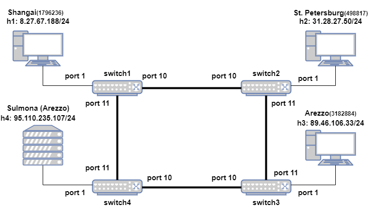

# P4_firewall
The objective of this tutorial is to write a P4 program that enables a P4 programmed switch to support the following features:

+ It simply forwards all non-SSH incoming packets carried over IPV4 according to the content of the forwarding tables.
+  It drops all SSH incoming packets that do not have a valid GSS header (custom header).
+ It drops all SSH incoming packets that have a given geoname_id (custom header protocol field), inserted at runtime by the network controller in the firewall table.
+ It forwards all SSH incoming packets that have a geoname_id, not present in the firewall table.
+ It forwards all packets coming from the controller, i.e. all the packet-outs according to the forwarding rules.
+ It forwards to the controller all SSH incoming packets that have a valid GSS header and an allowed geoname_id (i.e., all the SSH packets that have passed the firewall rules) whenever the controller has to perform spoof checks. 

Our P4 program will be written for the V1Model architecture implemented on P4.org's bmv2 software switch. We will use the following topology for this exercise: 

In order to redo the exercise, these simple steps need to be followed:
+ Download the VM with preinstalled tools available [here](https://github.com/p4lang/tutorials)
+ Enter in the p4 account and use the "git clone" command to clone this epository, after entering the "Dekstop" folder.
+ Install geoip2 Python package ([see here](https://pypi.org/project/geoip2/))
+ Give the command "sudo python3 run_mininet.py --p4-file switch_config.p4" after entering the "P4_Project" folder contained in the previously cloned repository. This command will:
  + compile switch_config.p4
  + start the topology in Mininet
  + configure all switches with the P4 program
  + configure all hosts with the commands listed in the file topology.json
+ Give the command "sudo python3 controller.py" after entering the "P4_Project" folder contained in the previously cloned repository from another terminal. This command will start the network controller. The controller will:
  + configure all switches with the appropriate table entries
  + perform DoS or DDoS detection (by simply reading a counter periodically)
  + perform spoofing check (on the geoname_id GSS field) when requested from the user
+ Give the command pingall in the Mininet CLI to check if all the previous steps were successful

**<h1>Notice:</h1>** If you want to have more details on this project implementation, please have a look at [Report_ASDN.pdf](./Report_ASDN.pdf).
**<h1>A note about the control plane</h1>**

A P4 program defines a packet-processing pipeline, but the rules within each table are inserted by the control plane. When a rule matches a packet, its action is invoked with parameters supplied by the control plane as part of the rule.  We use P4Runtime to install the control plane rules.
